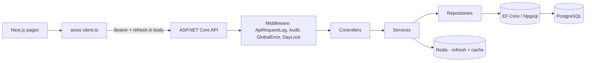

# DMS Backend Implementation Plan

## Stack confirmed (from current code)

- ASP.NET Core on `net10.0` (`[DMS-Backend/DMS-Backend.csproj](DMS-Backend/DMS-Backend.csproj)`), EF Core 10 + Npgsql, BCrypt, JWT Bearer, StackExchange.Redis, FluentValidation (already referenced — wire it up).
- DB seeded with `users`, `roles`, `permissions`, `user_roles`, `role_permissions`, `audit_logs`, `system_logs`, `authentication_logs`, `api_request_logs` (`[DMS-Backend/Data/ApplicationDbContext.cs](DMS-Backend/Data/ApplicationDbContext.cs)`).
- Auth scaffold exists: `[DMS-Backend/Controllers/AuthController.cs](DMS-Backend/Controllers/AuthController.cs)`, `[DMS-Backend/Services/Implementations/AuthService.cs](DMS-Backend/Services/Implementations/AuthService.cs)`, JWT / refresh / Redis fallback.
- Frontend talks to backend via `[DMS-Frontend/src/lib/api/client.ts](DMS-Frontend/src/lib/api/client.ts)` + `[DMS-Frontend/src/lib/api/auth.ts](DMS-Frontend/src/lib/api/auth.ts)`; everything else is mock data under `DMS-Frontend/src/lib/mock-data/*`.

## Confirmed approach

- **Order**: horizontal — finish all CRUD masters first, then move outward.
- **Refresh token transport**: return `refreshToken` in the login/refresh JSON body; persist alongside `accessToken` in `[DMS-Frontend/src/lib/stores/auth-store.ts](DMS-Frontend/src/lib/stores/auth-store.ts)`. Drop the cookie path entirely.

## Conventions (apply across every phase)

- Folder layout per module: `Controllers/<Module>Controller.cs`, `Services/Interfaces/I<Module>Service.cs`, `Services/Implementations/<Module>Service.cs`, `Repositories/<Module>Repository.cs`, `Models/Entities/<Entity>.cs`, `Models/DTOs/<Module>/...`, `Validators/<Module>/...`, `Mapping/<Module>Profile.cs`.
- All routes under `/api/<module>` (kebab-case), responses use `ApiResponse<T>` envelope or RFC 7807 `ProblemDetails` for errors.
- All non-log domain entities get `IsActive`, `CreatedAt`, `UpdatedAt`, `CreatedById`, `UpdatedById`; **no hard deletes** — implement EF global query filter on `IsActive` per requirements §1.
- Every write protected by `[Authorize]` + `[HasPermission("module:action")]` attribute mapped to `RolePermission` codes already seeded in `[DMS-Backend/Data/Seeders/PermissionSeeder.cs](DMS-Backend/Data/Seeders/PermissionSeeder.cs)`.
- Frontend pattern per module: add `DMS-Frontend/src/lib/api/<module>.ts` (axios calls + types mirroring backend DTOs), replace `import ... from '@/lib/mock-data/...'` with `useQuery`/`useMutation` (TanStack Query — add as a new dep) wrapping these api files; delete the mock import last.

## Architecture diagram

## Phase 0 — Cross-cutting foundation (small, do first)

These unblock every later phase. Each is its own task.

- **0.1** Wire FluentValidation: `services.AddFluentValidationAutoValidation()` in `Program.cs`; add `IValidator<T>` discovery from assembly. Reference: `[DMS-Backend/Program.cs](DMS-Backend/Program.cs)`.
- **0.2** Add AutoMapper + base `MappingProfile`; install `AutoMapper.Extensions.Microsoft.DependencyInjection`.
- **0.3** Add `ApiResponse<T>` envelope + `Result`/`Error` types; add global `ExceptionMiddleware` returning `ProblemDetails`.
- **0.4** Add `ApiRequestLoggingMiddleware` writing to `api_request_logs` (correlate by `RequestId` header).
- **0.5** Add `AuditLogService` + `[Audit]` attribute / interceptor that writes `audit_logs` for create/update/soft-delete on domain entities.
- **0.6** Add `IPermissionAuthorizationHandler` + `[HasPermission("code")]` attribute reading claims set in `[JwtService.cs](DMS-Backend/Services/Implementations/JwtService.cs)`.
- **0.7** Add `IDayLockService` + `[DayLockGuard]` to block edits on locked dates (used later by Operations/Production/Reports).
- **0.8** Add `BaseEntity` (`IsActive`, audit fields) + EF global query filter for soft delete; add `BaseRepository<T>` generic CRUD.
- **0.9** Configure Serilog (sink: console + `system_logs` table via existing `SystemLogService`) and `DateTime` UTC convention.
- **0.10** Add per-environment CORS for `http://localhost:3000` (already done) and a dev seed of demo data toggled by `appsettings.Development.json`.

## Phase 1 — Finish auth (small)

- **1.1 Backend**: in `[AuthService.cs](DMS-Backend/Services/Implementations/AuthService.cs)` change `LoginAsync` to also return `RefreshToken`; update `LoginResponseDto` (`Models/DTOs/Auth/LoginResponseDto.cs`). Update `[AuthController.cs](DMS-Backend/Controllers/AuthController.cs)` `Login`/`Refresh` to put `refreshToken` in the JSON body and read it from `{ refreshToken }` body on `POST /api/auth/refresh`. Remove cookie code.
- **1.2 Frontend**: store `refreshToken` in `[auth-store.ts](DMS-Frontend/src/lib/stores/auth-store.ts)`; in `[client.ts](DMS-Frontend/src/lib/api/client.ts)` 401 interceptor send `{ refreshToken }` body; drop `withCredentials`. Update types in `[auth.ts](DMS-Frontend/src/lib/api/auth.ts)`.
- **1.3** Implement `POST /api/auth/change-password` (consumed by `[change-password/page.tsx](DMS-Frontend/src/app/(dashboard)/change-password/page.tsx)`).
- **1.4** Implement `POST /api/auth/forgot-password` + `POST /api/auth/reset-password` (consumed by `[forgot-password/page.tsx](DMS-Frontend/src/app/(auth)/forgot-password/page.tsx)`) — token + email send (use a stub mailer in dev).
- **1.5** Add `RefreshTokenRotationOptions` so `RefreshTokenAsync` rotates tokens on each refresh and revokes the old one.

## Phase 2 — RBAC management (consumes 3 admin pages)

Pages: `administrator/users`, `administrator/roles`, `administrator/permissions`. Mock shapes in `[users.ts](DMS-Frontend/src/lib/mock-data/users.ts)`.

- **2.1** `UsersController` — `GET/POST/PUT /api/users`, `DELETE` = soft-delete, `POST /api/users/{id}/roles` to assign roles, `POST /api/users/{id}/reset-password`.
- **2.2** `RolesController` — full CRUD, `POST /api/roles/{id}/permissions` (assign permission set).
- **2.3** `PermissionsController` — `GET /api/permissions` (list, group by `Module`), seeded only.
- **2.4** Frontend api modules: `lib/api/users.ts`, `roles.ts`, `permissions.ts`; replace `mockUsers/mockRoles/mockPermissions` imports.

## Phase 3 — Inventory masters (4 pages)

Pages: `inventory/products`, `inventory/category`, `inventory/uom`, `inventory/ingredient`. Mock shapes in `[products.ts](DMS-Frontend/src/lib/mock-data/products.ts)` + `[products-full.ts](DMS-Frontend/src/lib/mock-data/products-full.ts)` + `[ingredients-full.ts](DMS-Frontend/src/lib/mock-data/ingredients-full.ts)`.

- **3.1** `Category`, `UnitOfMeasure` entities + CRUD endpoints.
- **3.2** `Product` entity (incl. enhanced flags: `productType`, `productionSection`, `allowFutureLabelPrint`, rounding fields, code, pricing) + CRUD.
- **3.3** `Ingredient` entity (raw vs semi-finished, extra-percentage flags) + CRUD.
- **3.4** Frontend api modules: `lib/api/categories.ts`, `uoms.ts`, `products.ts`, `ingredients.ts`; rewire pages.

## Phase 4 — Other masters (admin)

Pages under `administrator/*` not in Phase 2: `day-types`, `delivery-turns`, `section-consumables` (via `inventory` flow), `label-templates`, `label-settings`, `system-settings`, `rounding-rules`, `price-manager`, `workflow-config`, `grid-configuration`, `security`, `delivery-plan` (admin), `showroom-employee`, `day-lock`, `approvals`. Plus `showroom/page.tsx`.

- **4.1** Showroom (`Outlet`) entity + variants (`[outlets-with-variants.ts](DMS-Frontend/src/lib/mock-data/outlets-with-variants.ts)`) + CRUD; supports `getFlattenedOutletsForGrid` semantics.
- **4.2** `DayType` + `DeliveryTurn` + `ProductionSection` + `SectionConsumable` entities + CRUD.
- **4.3** `LabelTemplate`, `LabelSetting`, `RoundingRule`, `PriceList/PriceChange`, `GridConfiguration`, `WorkflowConfig`, `SystemSetting` (key/value), `SecurityPolicy` — CRUD endpoints (these are mostly simple key/value or list rows).
- **4.4** `DayLock` entity + `POST /api/day-lock/lock`, `GET /api/day-lock/status`; integrate with `[DayLockGuard]` from 0.7.
- **4.5** `ApprovalQueue` (`administrator/approvals`) — generic table for pending approvals raised by other modules (stock-adjustment, cancellation, etc.); endpoints `GET /pending`, `POST /{id}/approve`, `POST /{id}/reject`.
- **4.6** `ShowroomEmployee` mapping CRUD.
- **4.7** Frontend: matching `lib/api/*.ts` modules, replace mocks across these admin pages.

## Phase 5 — DMS bakery core (the largest phase, split many ways)

Pages under `(dashboard)/dms/*`. Use **enhanced** versions where dual exists (`order-entry-enhanced`, `stores-issue-note-enhanced`, `production-planner-enhanced`); keep legacy pages working off the same APIs by mapping to a smaller DTO.

- **5.1** **Recipes**: `Recipe`, `RecipeComponent`, `RecipeIngredient`, `RecipeTemplate` from `[enhanced-models.ts](DMS-Frontend/src/lib/mock-data/enhanced-models.ts)`; CRUD + `POST /api/recipes/{productId}/calculate?qty=` for the dough/anytime calculators.
- **5.2** **Default quantities** (`dms/default-quantities`): per outlet × day type matrix CRUD.
- **5.3** **Delivery plan** (`dms/delivery-plan`): plan headers per date/turn + line items; bulk save grid.
- **5.4** **Order entry** (`dms/order-entry-enhanced`): order header + outlet × product × turn lines; supports decimals, freezer flags, sections; bulk upsert endpoint.
- **5.5** **Immediate orders** (`dms/immediate-orders`): ad-hoc lines tied to date/turn/outlet.
- **5.6** **Delivery summary** (`dms/delivery-summary`) and **dashboard pivot** (`dms/dashboard-pivot`): read-only aggregation endpoints (server-side group-by).
- **5.7** **Freezer stock** (`dms/freezer-stock`): per product/section CRUD + history.
- **5.8** **Production planner** (`dms/production-planner-enhanced`): compute view from orders + recipes; endpoint returns per-section sheets; persist adjustments.
- **5.9** **Stores Issue Note** (`dms/stores-issue-note-enhanced`): compute totals from planner + recipes; persist SIN with extras (Viyana roll flour rule).
- **5.10** **Print bundles** (`dms/print-receipt-cards`, `dms/section-print-bundle`): server-rendered data endpoints used by client print.
- **5.11** **Reconciliation** (`dms/reconciliation`): outlet × product variance endpoint.
- **5.12** Frontend: one api module per feature (e.g. `lib/api/recipes.ts`, `delivery-plans.ts`, `orders.ts`, `production-planner.ts`, `sin.ts`, …).

## Phase 6 — Operations

Pages under `operation/*`: `delivery`, `disposal`, `transfer`, `stock-bf`, `cancellation`, `delivery-return`, `label-printing`, `showroom-open-stock`, `showroom-label-printing`. Shapes in `[operations.ts](DMS-Frontend/src/lib/mock-data/operations.ts)`.

- **6.1** Document entities: `Delivery`, `DeliveryItem`, `Disposal`, `Transfer`, `StockBF`, `Cancellation`, `DeliveryReturn`, `OpenStock` — each with header + lines, status workflow (`Draft`/`Submitted`/`Approved`/`Cancelled`).
- **6.2** Per-doc controllers with `GET list (filter by date/showroom)`, `GET {id}`, `POST`, `PUT`, `POST /submit`, `POST /cancel`. Apply `[DayLockGuard]`.
- **6.3** Label endpoints: `GET /api/labels/print?...` returning structured label payload (respects `allowFutureLabelPrint`, `dateRules`).
- **6.4** Frontend api modules + wiring.

## Phase 7 — Production & stock

Pages under `production/*`: `daily-production`, `production-cancel`, `current-stock`, `stock-adjustment`, `stock-adjustment-approval`, `production-plan`. Shapes in `[production.ts](DMS-Frontend/src/lib/mock-data/production.ts)`.

- **7.1** `DailyProduction` (header+lines), `ProductionPlan`, `StockMovement` (current stock derived view).
- **7.2** `StockAdjustment` with approval workflow → routes through `ApprovalQueue` from 4.5; `stock-adjustment-approval` consumes `/api/approvals?type=stock-adjustment`.
- **7.3** `current-stock` read endpoint computed from `StockMovement` (production+delivery+disposal+transfer+adjustments).
- **7.4** Frontend api modules + wiring.

## Phase 8 — Reports & Day-end

Page: `reports/page.tsx` (10 report types + per-report permission keys), `administrator/day-end-process`, `cashier-balance`.

- **8.1** `POST /api/day-end` — closes the date, writes to `DayLock`, updates `lastDayEndProcessDate` returned to UI (consumed by `[day-end-store.ts](DMS-Frontend/src/lib/stores/day-end-store.ts)`).
- **8.2** Generic `POST /api/reports/{key}` endpoint per report type (sales, delivery, disposal, inventory, product, showroom, category, daily, monthly, P&L) returning rows + totals; enforce min-date = day after `lastDayEndProcessDate` and `[HasPermission]`.
- **8.3** `CashierBalance` endpoints.
- **8.4** Dashboard widgets (`components/dashboard/*`): `GET /api/dashboard/sales-trend`, `/disposal-by-section`, `/top-deliveries`, `/delivery-vs-disposal`, `/recent-activity`.

## Phase 9 — Importers

- **9.1** File-storage abstraction (`IFileStorage` → local disk in dev, S3-compatible later).
- **9.2** `POST /api/import/upload` returns `uploadId`; `POST /api/import/parse/{uploadId}` returns parsed rows for preview; `POST /api/import/commit/{uploadId}` applies to chosen `TargetEntity`. Used by `[importer/page.tsx](DMS-Frontend/src/app/(dashboard)/dms/importer/page.tsx)`.
- **9.3** `POST /api/recipes/upload` for `[dms-recipe-upload/page.tsx](DMS-Frontend/src/app/(dashboard)/dms/dms-recipe-upload/page.tsx)`.
- **9.4** Use ClosedXML for `.xlsx`; for `.xlsm` macros are ignored, only sheet data parsed.

## Phase 10 — Hardening (last)

- **10.1** Rate limiting on `/api/auth/*`.
- **10.2** Integration tests (xUnit + WebApplicationFactory + Testcontainers Postgres) for each controller's happy path.
- **10.3** Swagger/OpenAPI grouping by module + auth scheme docs.
- **10.4** Update `appsettings.json` real secrets via user-secrets / env vars; remove dev password from `appsettings.Development.json`.

## Notes on dual frontend pages

The repo has both legacy and `-enhanced` versions of order entry, SIN, and production planner. The plan backs the **enhanced** DTO in the API; legacy pages will receive a thinner projection from the same endpoints (no separate APIs). I will not delete legacy pages — that's a frontend cleanup decision for later.