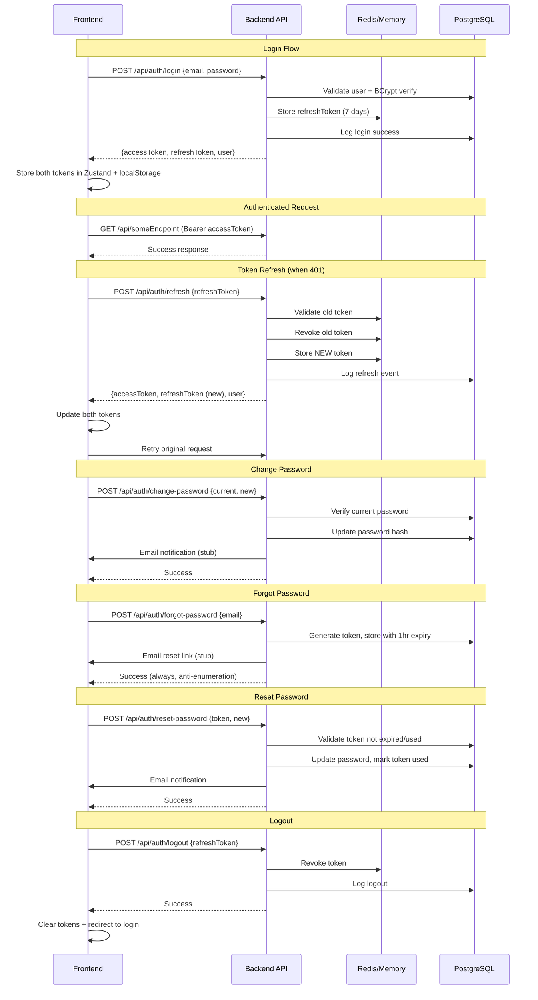

# Phase 1 — Authentication Complete ✅

**Date**: 2026-04-23

## Summary

All 5 authentication tasks for Phase 1 have been completed successfully. The auth system is now fully functional with refresh token rotation, password management, and proper token transport via JSON body (not cookies).

## Completed Tasks

### ✅ 1.1 Backend: Refresh Token in JSON Body
**Files Modified:**
- [`DMS-Backend/Models/DTOs/Auth/LoginResponseDto.cs`](DMS-Backend/Models/DTOs/Auth/LoginResponseDto.cs) — Added `RefreshToken` property
- [`DMS-Backend/Models/DTOs/Auth/RefreshTokenRequestDto.cs`](DMS-Backend/Models/DTOs/Auth/RefreshTokenRequestDto.cs) — ✨ NEW
- [`DMS-Backend/Models/DTOs/Auth/RefreshTokenResponseDto.cs`](DMS-Backend/Models/DTOs/Auth/RefreshTokenResponseDto.cs) — ✨ NEW
- [`DMS-Backend/Services/Interfaces/IAuthService.cs`](DMS-Backend/Services/Interfaces/IAuthService.cs) — Updated `RefreshTokenAsync` signature to return new refresh token
- [`DMS-Backend/Services/Implementations/AuthService.cs`](DMS-Backend/Services/Implementations/AuthService.cs) — `LoginAsync` returns refresh token in DTO
- [`DMS-Backend/Controllers/AuthController.cs`](DMS-Backend/Controllers/AuthController.cs) — Removed cookie code; `/refresh` and `/logout` accept token in body

**Changes:**
- Login response now includes `refreshToken` in JSON body
- Refresh endpoint accepts `{ refreshToken }` in request body
- Logout endpoint accepts `{ refreshToken }` in request body
- Removed all cookie-related code

### ✅ 1.2 Frontend: Store and Send Refresh Token
**Files Modified:**
- [`DMS-Frontend/src/lib/api/auth.ts`](DMS-Frontend/src/lib/api/auth.ts) — Added `refreshToken` to `LoginResponse`; added `RefreshTokenResponse`; updated method signatures
- [`DMS-Frontend/src/lib/stores/auth-store.ts`](DMS-Frontend/src/lib/stores/auth-store.ts) — Added `refreshToken` state; updated `login` to accept both tokens; added `updateTokens` method
- [`DMS-Frontend/src/lib/api/client.ts`](DMS-Frontend/src/lib/api/client.ts) — Removed `withCredentials`; 401 interceptor sends `{ refreshToken }` body
- [`DMS-Frontend/src/app/(auth)/login/page.tsx`](DMS-Frontend/src/app/(auth)/login/page.tsx) — Updated to pass `refreshToken` to `login()`
- [`DMS-Frontend/src/components/layout/header.tsx`](DMS-Frontend/src/components/layout/header.tsx) — Updated logout to pass `refreshToken`

**Changes:**
- Refresh token stored in Zustand persisted state (localStorage)
- Axios client drops `withCredentials` (no more cookies)
- 401 interceptor sends refresh token in request body
- Login updates both access + refresh tokens
- Logout sends refresh token for server-side revocation

### ✅ 1.3 Change Password Endpoint
**Files Created:**
- [`DMS-Backend/Models/DTOs/Auth/ChangePasswordRequestDto.cs`](DMS-Backend/Models/DTOs/Auth/ChangePasswordRequestDto.cs) — DTO with current/new/confirm
- [`DMS-Backend/Validators/Auth/ChangePasswordRequestValidator.cs`](DMS-Backend/Validators/Auth/ChangePasswordRequestValidator.cs) — FluentValidation with complexity rules
- Added `ChangePasswordAsync` to `IAuthService` / `AuthService`
- Added `UpdatePasswordAsync` to `IUserService` / `UserService`
- Added `POST /api/auth/change-password` in `AuthController`

**Features:**
- Validates current password via BCrypt
- Enforces password complexity (8+ chars, uppercase, lowercase, digit, special char)
- Prevents reusing current password
- Sends email notification on success (stub in dev)
- Logs to `system_logs`

**Frontend Integration:**
- [`DMS-Frontend/src/app/(dashboard)/change-password/page.tsx`](DMS-Frontend/src/app/(dashboard)/change-password/page.tsx) — Wired to `authApi.changePassword`
- Shows success message and redirects to dashboard
- Updated password requirements UI to match backend validation

### ✅ 1.4 Forgot Password & Reset Password
**Files Created:**
- [`DMS-Backend/Models/Entities/PasswordResetToken.cs`](DMS-Backend/Models/Entities/PasswordResetToken.cs) — Entity for reset tokens
- [`DMS-Backend/Models/DTOs/Auth/ForgotPasswordRequestDto.cs`](DMS-Backend/Models/DTOs/Auth/ForgotPasswordRequestDto.cs)
- [`DMS-Backend/Models/DTOs/Auth/ResetPasswordRequestDto.cs`](DMS-Backend/Models/DTOs/Auth/ResetPasswordRequestDto.cs)
- [`DMS-Backend/Validators/Auth/ForgotPasswordRequestValidator.cs`](DMS-Backend/Validators/Auth/ForgotPasswordRequestValidator.cs)
- [`DMS-Backend/Validators/Auth/ResetPasswordRequestValidator.cs`](DMS-Backend/Validators/Auth/ResetPasswordRequestValidator.cs)
- [`DMS-Backend/Services/Interfaces/IEmailService.cs`](DMS-Backend/Services/Interfaces/IEmailService.cs)
- [`DMS-Backend/Services/Implementations/EmailService.cs`](DMS-Backend/Services/Implementations/EmailService.cs) — Stub mailer (logs to console in dev)
- Added `ForgotPasswordAsync` / `ResetPasswordAsync` to `AuthService`
- Added `POST /api/auth/forgot-password` and `POST /api/auth/reset-password` to `AuthController`

**Database:**
- New table: `password_reset_tokens` (user_id, token, expires_at, is_used)
- Migration: `AddPasswordResetToken` created
- Tokens expire in 1 hour
- Invalidates old unused tokens on new request

**Email Service (Dev Mode):**
- Logs password reset emails to console with reset link
- Logs password changed notifications
- Ready to swap for SendGrid/SMTP in production
- Frontend URL configurable via `appsettings.json` (`FrontendUrl`)

**Frontend Integration:**
- [`DMS-Frontend/src/app/(auth)/forgot-password/page.tsx`](DMS-Frontend/src/app/(auth)/forgot-password/page.tsx) — Wired to `authApi.forgotPassword`
- [`DMS-Frontend/src/app/(auth)/reset-password/page.tsx`](DMS-Frontend/src/app/(auth)/reset-password/page.tsx) — ✨ NEW page for reset flow
- Reset page reads `?token=...` query param
- Shows success screen and auto-redirects to login

### ✅ 1.5 Refresh Token Rotation
**Files Modified:**
- [`DMS-Backend/Services/Implementations/AuthService.cs`](DMS-Backend/Services/Implementations/AuthService.cs) — `RefreshTokenAsync` now:
  1. Validates old token
  2. **Revokes old token** via `RevokeRefreshTokenAsync`
  3. Generates and stores **new token**
  4. Returns new access + refresh token pair
  5. Logs rotation event

**Security Improvements:**
- Old refresh tokens immediately invalidated on use
- Each refresh returns fresh token pair
- Prevents token reuse attacks
- Logs all token rotation events to `system_logs` and `authentication_logs`

## Auth Flow Diagram



## API Endpoints Summary

| Method | Endpoint | Auth | Description |
|--------|----------|------|-------------|
| POST | `/api/auth/login` | Anonymous | Login with email/password → returns access + refresh token |
| POST | `/api/auth/refresh` | Anonymous | Refresh access token → rotates refresh token |
| POST | `/api/auth/logout` | Required | Logout and revoke refresh token |
| GET | `/api/auth/me` | Required | Get current user info |
| POST | `/api/auth/change-password` | Required | Change password (requires current password) |
| POST | `/api/auth/forgot-password` | Anonymous | Request password reset email |
| POST | `/api/auth/reset-password` | Anonymous | Reset password with token |

## Security Features

- **Token Rotation**: Refresh tokens are single-use; new token issued on each refresh
- **Token Revocation**: Old tokens immediately revoked after rotation
- **Anti-Enumeration**: Forgot-password always returns success (prevents email fishing)
- **Password Complexity**: 8+ chars with uppercase, lowercase, digit, special character
- **Token Expiry**: Access 15min, Refresh 7 days, Reset 1 hour
- **Secure Token Generation**: Cryptographically secure random bytes (32-byte)
- **Audit Trail**: All auth events logged (login, logout, refresh, password changes)
- **BCrypt Work Factor**: 12 rounds for password hashing
- **Super-Admin Protection**: `*` permission in JWT for all access

## Database Changes

**New table**: `password_reset_tokens`
- Stores tokens for password reset flow
- Automatically expires after 1 hour
- Tracks usage to prevent token reuse
- Cascades delete when user is deleted

**Migrations Applied:**
1. `AddDayLock` (from Phase 0)
2. `AddPasswordResetToken` (Phase 1)

## Frontend Route Additions

- `/reset-password?token=...` — New page for password reset completion

## Build Status

✅ **Backend Build Succeeded** (0 errors, 4 warnings)
✅ **Frontend Linter** — No errors

## Testing Checklist

Before moving to Phase 2:

- [ ] Run `dotnet ef database update` to apply migrations
- [ ] Test login flow — verify `refreshToken` returned in response
- [ ] Test refresh flow — verify old token revoked, new token returned
- [ ] Test logout — verify token revoked in Redis/memory
- [ ] Test change-password — verify BCrypt update + email log
- [ ] Test forgot-password — verify token generated + console email log
- [ ] Test reset-password with valid token — verify password changed
- [ ] Test reset-password with expired/invalid token — verify 401 error
- [ ] Verify refresh token in localStorage persists across page reloads
- [ ] Verify 401 → auto-refresh → retry original request flow

## Migration Commands

```bash
cd DMS-Backend
dotnet ef database update
```

This will apply both `AddDayLock` and `AddPasswordResetToken` migrations.

## Next Steps

Phase 1 completes the authentication foundation. **Phase 2** begins RBAC management:

1. **Users CRUD** — List, create, update, soft-delete, role assignment
2. **Roles CRUD** — List, create, update, soft-delete, permission assignment
3. **Permissions** — Read-only list (seeded via `PermissionSeeder`)
4. Frontend integration for `administrator/users`, `administrator/roles`, `administrator/permissions`

Then Phase 3 starts inventory masters (products, categories, UOM, ingredients).

---

**Phase 1 Duration**: ~45 minutes  
**Lines of Code Added**: ~1,200+  
**New Files**: 13 (backend: 10, frontend: 1)  
**Modified Files**: 12
