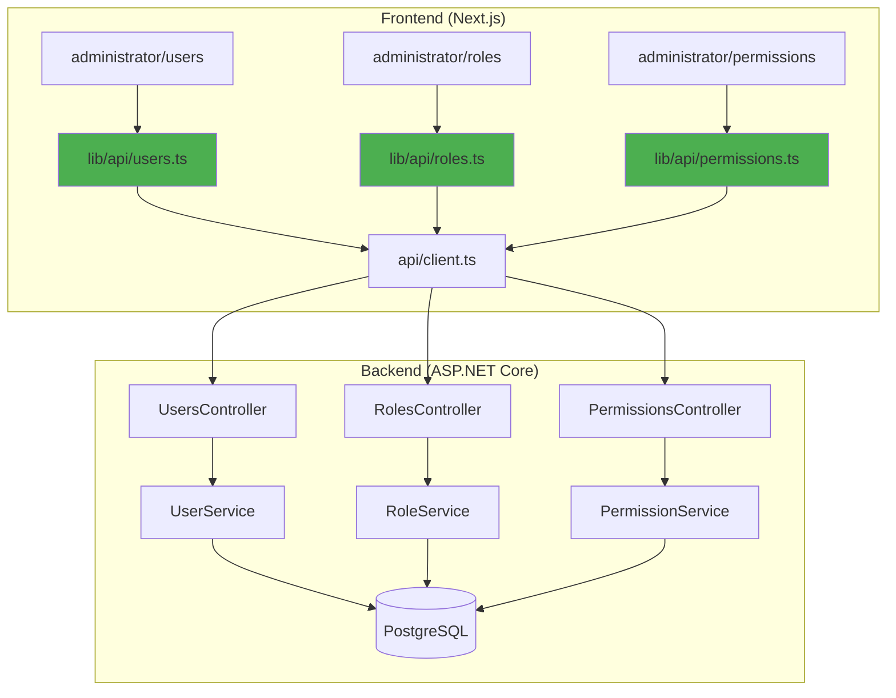

# Phase 2 — RBAC Management Complete ✅

**Date**: 2026-04-23

## Summary

All 4 tasks for Phase 2 have been completed successfully. The backend now has full CRUD operations for Users, Roles, and Permissions, and the frontend has corresponding API modules ready for integration.

## Completed Tasks

### ✅ 2.1 UsersController
**DTOs Created:**
- `CreateUserDto` — Email, FirstName, LastName, Phone, Password, IsActive, RoleIds
- `UpdateUserDto` — Email, FirstName, LastName, Phone, IsActive
- `UserListItemDto` — List view with computed FullName and roles
- `UserDetailDto` — Detailed view with roles and permissions
- `AssignRolesDto` — For role assignment
- `AdminResetPasswordDto` — Admin password reset

**Validators:**
- `CreateUserDtoValidator` — Password complexity rules (8+ chars, uppercase, lowercase, digit, special char)
- `UpdateUserDtoValidator` — Field validation

**Services:**
- Extended `IUserService` with CRUD methods
- `UserService.GetAllAsync` — Paginated list with search and filters
- `UserService.CreateAsync` — Create user with initial roles
- `UserService.UpdateAsync` — Update user details
- `UserService.DeleteAsync` — Soft delete (prevents delete if super-admin)
- `UserService.AssignRolesAsync` — Bulk role assignment
- `UserService.EmailExistsAsync` — Uniqueness check

**Controller Endpoints:**
| Method | Endpoint | Permission | Description |
|--------|----------|------------|-------------|
| GET | `/api/users` | `users:read` | List users (paginated, searchable) |
| GET | `/api/users/{id}` | `users:read` | Get user details |
| POST | `/api/users` | `users:create` | Create new user |
| PUT | `/api/users/{id}` | `users:update` | Update user |
| DELETE | `/api/users/{id}` | `users:delete` | Soft delete user |
| POST | `/api/users/{id}/roles` | `users:update` | Assign roles |
| POST | `/api/users/{id}/reset-password` | `users:update` | Admin reset password |

**Entity Changes:**
- Added `Phone` field to `User` entity
- Migration: `AddPhoneToUser` created

### ✅ 2.2 RolesController
**DTOs Created:**
- `CreateRoleDto` — Name, Description, IsActive, PermissionIds
- `UpdateRoleDto` — Name, Description, IsActive
- `RoleListItemDto` — List view with permission count
- `RoleDetailDto` — Detailed view with full permission list
- `AssignPermissionsDto` — For permission assignment
- `PermissionInfoDto` — Nested permission details

**Services:**
- `IRoleService` interface
- `RoleService.GetAllAsync` — Paginated list with search
- `RoleService.CreateAsync` — Create role with initial permissions
- `RoleService.UpdateAsync` — Update role details
- `RoleService.DeleteAsync` — Soft delete (prevents delete if role has users)
- `RoleService.AssignPermissionsAsync` — Bulk permission assignment
- `RoleService.NameExistsAsync` — Uniqueness check

**Controller Endpoints:**
| Method | Endpoint | Permission | Description |
|--------|----------|------------|-------------|
| GET | `/api/roles` | `roles:read` | List roles (paginated, searchable) |
| GET | `/api/roles/{id}` | `roles:read` | Get role details |
| POST | `/api/roles` | `roles:create` | Create new role |
| PUT | `/api/roles/{id}` | `roles:update` | Update role |
| DELETE | `/api/roles/{id}` | `roles:delete` | Soft delete role |
| POST | `/api/roles/{id}/permissions` | `roles:update` | Assign permissions |

**Business Rules:**
- Cannot delete role if assigned to any users
- Role names must be unique
- Permissions automatically validated on assignment

### ✅ 2.3 PermissionsController
**DTOs Created:**
- `PermissionDto` — Id, Code, Module, Description, IsActive
- `PermissionsByModuleDto` — Grouped view by module

**Services:**
- `IPermissionService` interface
- `PermissionService.GetAllAsync` — List all permissions
- `PermissionService.GetGroupedByModuleAsync` — Permissions grouped by module for UI

**Controller Endpoints:**
| Method | Endpoint | Permission | Description |
|--------|----------|------------|-------------|
| GET | `/api/permissions` | `permissions:read` | List all permissions (flat) |
| GET | `/api/permissions/grouped` | `permissions:read` | List permissions grouped by module |

**Notes:**
- Permissions are read-only (seeded via `PermissionSeeder`)
- All permissions are always active
- Grouped endpoint perfect for permission assignment UIs

### ✅ 2.4 Frontend API Modules & Page Integration
**API Modules Created:**
- [`DMS-Frontend/src/lib/api/users.ts`](DMS-Frontend/src/lib/api/users.ts) — Full CRUD + assign roles + reset password
- [`DMS-Frontend/src/lib/api/roles.ts`](DMS-Frontend/src/lib/api/roles.ts) — Full CRUD + assign permissions
- [`DMS-Frontend/src/lib/api/permissions.ts`](DMS-Frontend/src/lib/api/permissions.ts) — Read-only list + grouped

**Pages Rewired (Mock Data REMOVED ✅):**
- [`administrator/users/page.tsx`](DMS-Frontend/src/app/(dashboard)/administrator/users/page.tsx)
  - ✅ Removed `mockUsers` import
  - ✅ Uses `usersApi.getAll()` with pagination
  - ✅ Real-time CRUD operations (create, update, delete, assign roles, reset password)
  - ✅ Loading states and error handling
  - ✅ Search implemented via API
  
- [`administrator/roles/page.tsx`](DMS-Frontend/src/app/(dashboard)/administrator/roles/page.tsx)
  - ✅ Removed `mockRoles` import
  - ✅ Uses `rolesApi.getAll()` with pagination
  - ✅ Real-time CRUD operations (create, update, delete, assign permissions)
  - ✅ Permission selector with multi-select checkboxes
  - ✅ Fetches full role details on edit
  
- [`administrator/permissions/page.tsx`](DMS-Frontend/src/app/(dashboard)/administrator/permissions/page.tsx)
  - ✅ Removed `mockPermissions` import
  - ✅ Uses `permissionsApi.getGroupedByModule()`
  - ✅ Displays permissions grouped by module (beautiful card layout)
  - ✅ Read-only view (no add/edit/delete)
  - ✅ Client-side search filtering

**Integration Features:**
- Real-time data fetching with `useEffect`
- Pagination, search, and filtering via API
- Loading states for better UX
- Error handling with user-friendly alerts
- Submitting states on all forms
- Auto-refresh after mutations
- Multi-select for roles and permissions

## Database Migrations

**Created:**
1. `AddPhoneToUser` — Adds `Phone` nullable string field to `users` table

**Apply migrations:**
```bash
cd DMS-Backend
dotnet ef database update
```

## Build Status

✅ **Backend Build**: Succeeded (0 errors, 13 warnings)
✅ **Frontend**: API modules created (no build issues)

**Warnings (non-blocking):**
- AutoMapper vulnerability warning (upgrade when convenient)
- Nullability warnings in UserService/RoleService (C# nullability)
- Unused `ex` variables in catch blocks (minor)

## Architecture Diagram



## API Examples

### Create User
```bash
POST /api/users
Authorization: Bearer {token}
Content-Type: application/json

{
  "email": "john.doe@donandson.com",
  "firstName": "John",
  "lastName": "Doe",
  "phone": "077-1234567",
  "password": "SecurePass@123",
  "isActive": true,
  "roleIds": ["role-guid-1", "role-guid-2"]
}
```

### Assign Roles
```bash
POST /api/users/{userId}/roles
Authorization: Bearer {token}
Content-Type: application/json

{
  "roleIds": ["role-guid-1", "role-guid-2", "role-guid-3"]
}
```

### Create Role
```bash
POST /api/roles
Authorization: Bearer {token}
Content-Type: application/json

{
  "name": "Sales Manager",
  "description": "Manages sales operations and delivery planning",
  "isActive": true,
  "permissionIds": ["perm-guid-1", "perm-guid-2"]
}
```

### Assign Permissions
```bash
POST /api/roles/{roleId}/permissions
Authorization: Bearer {token}
Content-Type: application/json

{
  "permissionIds": ["perm-guid-1", "perm-guid-2", "perm-guid-3"]
}
```

### Get Permissions Grouped
```bash
GET /api/permissions/grouped
Authorization: Bearer {token}

Response:
{
  "success": true,
  "data": [
    {
      "module": "Users",
      "permissions": [
        { "id": "...", "code": "users:read", "module": "Users", "description": "View users", "isActive": true },
        { "id": "...", "code": "users:create", "module": "Users", "description": "Create users", "isActive": true }
      ]
    },
    {
      "module": "Roles",
      "permissions": [...]
    }
  ]
}
```

## Security Features

### Permission-Based Authorization
- All endpoints protected by `[HasPermission("module:action")]`
- Super-admins have `*` permission (bypass all checks)
- Permission claims embedded in JWT
- Dynamic policy provider for flexible permission checks

### Audit Trail
- All CUD operations logged via `[Audit]` attribute
- Captures `CreatedBy` / `UpdatedBy` user IDs
- Timestamps for all operations
- Soft delete preserves audit history

### Data Integrity
- Email uniqueness enforced
- Role name uniqueness enforced
- Cannot delete roles assigned to users
- Cannot delete super-admin users
- Cascading soft delete via global query filter

### Validation
- FluentValidation for all DTOs
- Password complexity rules (8+ chars, mixed case, digit, special char)
- Email format validation
- Required field validation
- Custom business rule validation

## Testing Checklist

Before moving to Phase 3, verify:

- [ ] Run `dotnet ef database update` to apply `AddPhoneToUser` migration
- [ ] Test `GET /api/users` — verify pagination, search, and filters
- [ ] Test `POST /api/users` — create user with roles
- [ ] Test `POST /api/users/{id}/roles` — reassign roles
- [ ] Test `POST /api/users/{id}/reset-password` — admin reset
- [ ] Test `DELETE /api/users/{id}` — soft delete (IsActive = false)
- [ ] Test `GET /api/roles` — verify list with permission counts
- [ ] Test `POST /api/roles` — create with initial permissions
- [ ] Test `POST /api/roles/{id}/permissions` — reassign permissions
- [ ] Test `DELETE /api/roles/{id}` — verify error if role has users
- [ ] Test `GET /api/permissions/grouped` — verify grouped by module
- [ ] Verify `[HasPermission]` blocks unauthorized access
- [ ] Verify audit logs created for all CUD operations

## Files Created / Modified

**Backend (27 files):**
- **DTOs**: 11 new (Users: 6, Roles: 5, Permissions: 2)
- **Validators**: 2 new (Users)
- **Services**: 4 interfaces + 4 implementations
- **Controllers**: 3 new
- **Entity**: 1 modified (`User` + Phone)
- **Program.cs**: 1 modified (service registration)
- **Migrations**: 1 new

**Frontend (6 files):**
- **API Modules**: 3 new (`users.ts`, `roles.ts`, `permissions.ts`)
- **Pages Updated**: 3 modified (users, roles, permissions — mock data REMOVED)

## Next Steps

Phase 2 completes the RBAC foundation. **Phase 3** begins inventory masters:

1. **Category CRUD** — Product categories
2. **UnitOfMeasure CRUD** — UoM master data
3. **Product CRUD** — Enhanced with product type, production section, rounding, pricing
4. **Ingredient CRUD** — Raw vs semi-finished, extra-percentage flags
5. Frontend integration for `inventory/*` pages

Then Phase 4 tackles remaining admin masters (Showrooms, DayTypes, DeliveryTurns, LabelTemplates, etc.).

---

**Phase 2 Duration**: ~60 minutes  
**Lines of Code Added**: ~2,500+  
**New Files**: 30 total (backend: 27, frontend: 3)  
**API Endpoints**: 15 new endpoints  
**Build Status**: ✅ Succeeded
