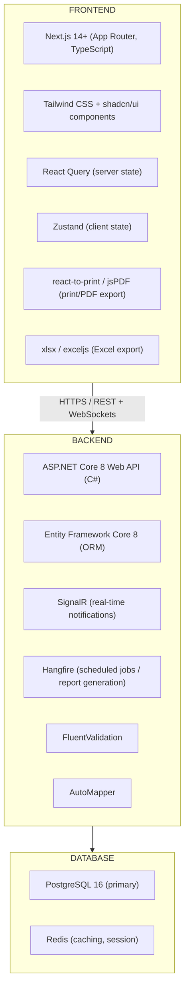

## Page 1

# Don & Sons (Pvt) Ltd. — Delivery Management System (DMS)

## Complete ERP Implementation Plan

**Prepared By:** ERP Consultant & Software Solution Architect  
**Company:** Don & Sons (Pvt) Ltd.  
**Document Version:** 1.0  
**Date:** April 2026  
**Tech Stack:** Next.js (Frontend) + ASP.NET Core (Backend) + PostgreSQL (Database)

---

## Table of Contents

1.  [Executive Summary](#1-executive-summary)
2.  [As-Is Analysis: Excel Workbook Deep Study](#2-as-is-analysis-excel-workbook-deep-study)
3.  [System Architecture](#3-system-architecture)
4.  [Database Design](#4-database-design)
5.  [Core Modules & Feature Specifications](#5-core-modules--feature-specifications)
6.  [Business Rules & Calculation Engine](#6-business-rules--calculation-engine)
7.  [Report & Print Specifications](#7-report--print-specifications)
8.  [UI/UX Design Guidelines](#8-ui-ux-design-guidelines)
9.  [API Design](#9-api-design)
10. [Development Phases & Milestones](#10-development-phases--milestones)
11. [Non-Functional Requirements](#11-non-functional-requirements)
12. [Risk Register](#12-risk-register)

---

## 1. Executive Summary

Don & Sons (Pvt) Ltd. currently operates a daily bakery and short-eats production and delivery operation using a complex Excel workbook (.xlsm). The workbook manages up to 4 delivery turns per day across multiple outlets, covers recipe management for dozens of products distributed across multiple production sections (Bakery, Filling, Short-Eats/Pastry, Rotty, Plain Roll), and produces section-specific store issue notes, production planners, and delivery summaries.

The goal is to replace this Excel workbook entirely with a web-based ERP system while faithfully replicating every calculation, workflow, and report — and extending it with proper

---


## Page 2

access control, auditability, and flexibility.

## 2. As-Is Analysis: Excel Workbook Deep Study

### 2.1 Sheets Identified and Their Roles

<table>
  <thead>
    <tr>
      <th>Sheet Name</th>
      <th>Purpose</th>
    </tr>
  </thead>
  <tbody>
    <tr>
      <td>Home</td>
      <td>Landing page with date, company name</td>
    </tr>
    <tr>
      <td>Dashboard</td>
      <td>Pivot summary of all items across turns and outlets</td>
    </tr>
    <tr>
      <td>Users</td>
      <td>User list with username, password, permission level</td>
    </tr>
    <tr>
      <td>Data</td>
      <td>Outlet-wise base order quantities (weekday defaults)</td>
    </tr>
    <tr>
      <td>Order</td>
      <td>Daily order entry form — item vs. outlet quantity grid with Full/Mini, BAL, Extra, and multi-turn columns</td>
    </tr>
    <tr>
      <td>Delivery Summary</td>
      <td>Consolidated delivery quantities per item per outlet for the 5 AM turn, with Y/N production flag</td>
    </tr>
    <tr>
      <td>5.00AM 3X Delivery</td>
      <td>Delivery note layout for 5 AM — repeated 3 times (Mon-Wed, Thu-Fri, Saturday columns)</td>
    </tr>
    <tr>
      <td>10.30AM & 3.30PM Summary</td>
      <td>Delivery layouts for the second and third delivery turns</td>
    </tr>
    <tr>
      <td>Bakery</td>
      <td>Bakery section production sheet — items with quantities and egg/ingredient totals</td>
    </tr>
    <tr>
      <td>Bakery Recipe Per Item</td>
      <td>Per-item ingredient quantities (recipe template) — one column per product</td>
    </tr>
    <tr>
      <td>Bakery Recipe Calculation</td>
      <td>Actual recipe calculation = recipe per item × production quantity; covers all turns</td>
    </tr>
    <tr>
      <td>Bakery Recipe for Stores</td>
      <td>Same as above but with extra/waste quantities included for stores issue note</td>
    </tr>
    <tr>
      <td>Printing</td>
      <td>Master printing sheet — fills in section-wise issue notes for Filling, Bakery 1, Bakery 2, Shorteats 1, Rotty, etc., each with production start time and effective delivery time</td>
    </tr>
  </tbody>
</table>

---


## Page 3

<table>
  <thead>
    <tr>
      <th>Sheet Name</th>
      <th>Purpose</th>
    </tr>
  </thead>
  <tbody>
    <tr>
      <td>Calculation</td>
      <td>Cross-turn totals and computation intermediaries</td>
    </tr>
    <tr>
      <td>Recipe Per Item</td>
      <td>Filling/short-eats recipe per item (ingredients per piece)</td>
    </tr>
    <tr>
      <td>Curry Sheet</td>
      <td>Curry-type products with selectable vegetable curry recipe loading</td>
    </tr>
    <tr>
      <td>Recipe for Curry Items</td>
      <td>Curry ingredient recipe calculation</td>
    </tr>
    <tr>
      <td>Vegetable Curry Sheet</td>
      <td>Detailed veg curry calculation</td>
    </tr>
    <tr>
      <td>Printing Filling Section</td>
      <td>Filling section-specific print layout</td>
    </tr>
    <tr>
      <td>Printing Receipt</td>
      <td>Receipt-style print layouts</td>
    </tr>
    <tr>
      <td>Plain Roll Section</td>
      <td>Plain roll production with garnish details</td>
    </tr>
    <tr>
      <td>Filling Section</td>
      <td>Per-item ingredient recipe for all filling/sandwich/roll items</td>
    </tr>
    <tr>
      <td>Size Totals</td>
      <td>Full vs. Mini quantity totals per item</td>
    </tr>
    <tr>
      <td>Section Printing</td>
      <td>Section-wise production printing</td>
    </tr>
    <tr>
      <td>DMS Recipe / DMS Recipe Upload</td>
      <td>Recipe master data tables</td>
    </tr>
    <tr>
      <td>Egg Sandwich Label</td>
      <td>Label printing</td>
    </tr>
    <tr>
      <td>Patties Dough</td>
      <td>Pattie dough calculation</td>
    </tr>
    <tr>
      <td>Doughs</td>
      <td>Aggregate dough requirements</td>
    </tr>
  </tbody>
</table>

## 2.2 Key Data Entities Observed

**Products (Items):** ~80+ products including Bread, Sandwiches, Buns (Tea Bun, Sugar Bun, Fish Bun, Viyana Roll...), Chinese Rolls, Patties, Pastries, Pies, Rottys, Pizzas, Spring Rolls, Savoury Rolls, Hot Dogs, Burgers, Cutlets, Stuffed Chillies. Each has:

*   A unique code (BR1, BU4, SAN7, SE8, PS5...)
*   A category/type (Bread, Bun, Sandwich, Short-Eat, Pizza, Pastry, Pattie, Rotty...)
*   Full-size and/or Mini variants
*   A production section assignment

---


## Page 4

* A Y/N flag for whether it is produced in a given turn

**Outlets:** DBQ, SJE, YRK, KEL, BC, SGK, KML, BWA, RAG, KDW, WED, RAN, DAL, SRP — each with its own quantity column in the order grid. Each outlet has an active/inactive checkbox per delivery turn.

**Delivery Turns:** The file shows three turns (5:00 AM, 10:30 AM, 3:30 PM) with separate quantity sets. The system must support 2-4 turns configurable by admin.

**Production Sections:** Bakery 1, Bakery 2, Filling Section, Short-Eats 1 (prepare), Short-Eats 2 (crumb & fry), Rotty Section, Plain Roll Section, Pastry Section — each with its own production start time and effective delivery time.

**Recipes:** Two-layer recipe structure:
* **Per-Item Recipe** (Bakery Recipe Per Item, Filling Section): ingredient quantity per 1 unit of product
* **Calculated Recipe** (Bakery Recipe Calculation): per-item qty × production quantity = total ingredient requirement
* **Stores Issue Version:** total + extra/waste allowance per ingredient (only for stores, not shown in production)

**Sugar Candy Bun:** Uses a two-component recipe — separate Dough quantities and Bun quantities for the same item.

**Viyana Roll / Viyana Roll Mini:** Separate items with distinct recipes; both Full and Mini versions.

**Vegetable Curry:** Selectable curry type — recipe loads from predefined templates when product is created.

**2.3 Calculations Observed**
* Order Total = Outlet quantities + Extra + Order Full + Order Mini
* Production Qty = Total Full + Total Mini (shown separately)
* Recipe Quantity = Per-Item Ingredient Qty × Production Qty
* Stores Issue Qty = Recipe Qty + Extra Waste Qty (only on stores sheet)
* Available Balance Reduction: Stores Issue Qty = Recipe Qty - Freezer Stock (only on stores sheet)
* Egg totals in Bakery: Beehive value × 30g factor (e.g., 354g ÷ 30 = 11.81 "eggs as butter equivalent")
* Pattie Dough: Flour, Beehive, Salt, Eggs calculated based on pattie quantities
* Chinese Roll Batter: Flour (12 kg), Salt (210g), Eggs, Oil — linked to total rolls

---


## Page 5

*   **Rotty Dough:** Flour, Salt, Sugar, Eggs based on total rotty count
*   **Extra Qty for ingredients** (e.g., carrots — raw weight > cleaned weight): admin-configured per ingredient, only visible on stores sheet
*   **Rounding:** Item-level rounding configurable per item (e.g., round to nearest 5)

---

## 3. System Architecture

### 3.1 Technology Stack



### 3.2 Deployment Architecture

```mermaid
flowchart TD
    Internet --> App

---


## Page 6

mermaid
flowchart TD
    subgraph Nginx (Reverse Proxy + SSL Termination)
    id_0[|]
    id_1[|]
    id_2[|]
    end
    subgraph PostgreSQL (port 5432)
    id_3[|]
    end
    subgraph Redis (port 6379)
    id_4[|]
    end
    subgraph ASP.NET Core (port 5000)
    id_5[|]
    end
    subgraph Next.js (port 3000)
    id_6[|]
    end

    %% --- Links ---
    id_0 -- / --> id_6
    id_0 -- /api --> id_5
    id_5 -- | --> id_3
    id_5 -- | --> id_4
    id_6 -- | --> id_1
    id_1 -- | --> id_2
    id_2 -- | --> id_3
    id_2 -- | --> id_4
```

---

## 4. Database Design

### 4.1 Core Tables

#### users

```sql
id, username, first_name, last_name, password_hash, role (Admin|Manager|User),
is_active, created_at, updated_at
```

#### outlets

```sql
id, code, name, address, contact, is_active, sort_order, created_at
```

#### delivery_turns

```sql
id, name (e.g. "5:00 AM Delivery"), delivery_time (time),
is_active, sort_order
-- Note: turns are per-day configured, not fixed to 3
```

#### delivery_turn_sections

```sql
id, delivery_turn_id, section_id,
production_start_time (timestamp with tz - captures date + time e.g. previous evening),
effective_delivery_time (timestamp with tz),
notes

---


## Page 7

<table>
  <thead>
    <tr>
      <th colspan="2">production_sections</th>
    </tr>
  </thead>
  <tbody>
    <tr>
      <td colspan="2">sql</td>
    </tr>
    <tr>
      <td colspan="2">id, code, name (Bakery 1, Bakery 2, Filling Section, Short-Eats 1, Short-Eats 2, Rotty Section, Plain Roll Section, Pastry Section...), sort_order, is_active</td>
    </tr>
  </tbody>
</table>

<table>
  <thead>
    <tr>
      <th colspan="2">product_categories</th>
    </tr>
  </thead>
  <tbody>
    <tr>
      <td colspan="2">sql</td>
    </tr>
    <tr>
      <td colspan="2">id, code, name (Bread, Bun, Sandwich, Short-Eat, Pizza, Pastry, Pattie, Rotty...), sort_order</td>
    </tr>
  </tbody>
</table>

<table>
  <thead>
    <tr>
      <th colspan="2">product_types</th>
    </tr>
  </thead>
  <tbody>
    <tr>
      <td colspan="2">sql</td>
    </tr>
    <tr>
      <td colspan="2">id, code, name (Raw Material, Semi-Finished, Finished, Section), description</td>
    </tr>
  </tbody>
</table>

<table>
  <thead>
    <tr>
      <th colspan="2">products</th>
    </tr>
  </thead>
  <tbody>
    <tr>
      <td colspan="2">sql</td>
    </tr>
    <tr>
      <td colspan="2">id, code (BR1, BU4...), name, category_id, product_type_id, has_full_variant (bool), has_mini_variant (bool), allow_decimal_quantity (bool), -- admin sets per item weight_grams (nullable), -- e.g. Kurakkan Plain Bun = 35g is_active (bool), sort_order, rounding_value (nullable int), -- e.g. round up to nearest 5 standard_quantity (nullable), -- reference standard value notes, created_at, updated_at</td>
    </tr>
  </tbody>
</table>

<table>
  <thead>
    <tr>
      <th colspan="2">product_sections</th>
    </tr>
  </thead>
  <tbody>
    <tr>
      <td colspan="2">sql</td>
    </tr>
  </tbody>
</table>

---


## Page 8

html
<div>
  <div style="border: 1px solid black; padding: 10px; margin-bottom: 10px;">
    <pre>id, product_id, section_id,
-- A product can span multiple sections (bun dough in Bakery, filling in Filling)
is_primary (bool), sort_order</pre>
  </div>
  <h3>ingredients</h3>
  <div style="border: 1px solid black; padding: 10px; margin-bottom: 10px;">
    <pre>sql
id, code, name, unit (g|kg|Nos|ml|l|Bot),
product_type_id,    -- raw material / semi-finished
allow_extra_qty (bool),    -- admin can add extra waste allowance
extra_qty_note,    -- explanation (e.g. "cleaning loss")
is_active, created_at</pre>
  </div>
  <h3>product_recipes</h3>
  <div style="border: 1px solid black; padding: 10px; margin-bottom: 10px;">
    <pre>sql
id, product_id, section_id,
variant (Full|Mini|Both),
recipe_name (nullable -- for named sub-recipes like "Dough", "Bun" for Sugar Candy Bu
is_active, effective_from (date), notes</pre>
  </div>
  <h3>product_recipe_lines</h3>
  <div style="border: 1px solid black; padding: 10px; margin-bottom: 10px;">
    <pre>sql
id, product_recipe_id, ingredient_id,
quantity_per_unit (decimal),    -- per 1 piece of product
is_percentage (bool),    -- if true, qty is a % of another item
percentage_source_product_id (nullable),
extra_qty_per_unit (decimal default 0),    -- extra waste/loss quantity
extra_qty_visible_stores_only (bool default true),
sort_order</pre>
  </div>
  <h3>predefined_recipe_templates</h3>
  <div style="border: 1px solid black; padding: 10px; margin-bottom: 10px;">
    <pre>sql
id, name (e.g. "Vegetable Curry Base", "Standard Curry"),
description, is_active</pre>
  </div>
</div>

---


## Page 9

<table>
  <thead>
    <tr>
      <th>sql</th>
    </tr>
  </thead>
  <tbody>
    <tr>
      <td>id, template_id, ingredient_id, quantity_per_unit, sort_order</td>
    </tr>
  </tbody>
</table>

<table>
  <thead>
    <tr>
      <th>product_recipe_template_links</th>
    </tr>
  </thead>
  <tbody>
    <tr>
      <td>sql</td>
    </tr>
    <tr>
      <td>id, product_id, template_id, override_recipe (bool), -- if true, recipe is customized from template</td>
    </tr>
  </tbody>
</table>

<table>
  <thead>
    <tr>
      <th>delivery_plans</th>
    </tr>
  </thead>
  <tbody>
    <tr>
      <td>sql</td>
    </tr>
    <tr>
      <td>id, plan_date (date), plan_type (Weekdays|Saturday|Sunday|Custom), delivery_turn_id, status (Draft|Confirmed|InProduction|Delivered), created_by, confirmed_by, created_at, updated_at</td>
    </tr>
  </tbody>
</table>

<table>
  <thead>
    <tr>
      <th>delivery_plan_outlets</th>
    </tr>
  </thead>
  <tbody>
    <tr>
      <td>sql</td>
    </tr>
    <tr>
      <td>id, delivery_plan_id, outlet_id, is_active (bool), -- checkbox: outlet closed for this turn</td>
    </tr>
  </tbody>
</table>

<table>
  <thead>
    <tr>
      <th>delivery_plan_items</th>
    </tr>
  </thead>
  <tbody>
    <tr>
      <td>sql</td>
    </tr>
    <tr>
      <td>id, delivery_plan_id, product_id, is_active (bool), -- checkbox: item not produced this turn</td>
    </tr>
    <tr>
      <td>extra_quantity_full (decimal default 0),</td>
    </tr>
    <tr>
      <td>extra_quantity_mini (decimal default 0),</td>
    </tr>
    <tr>
      <td>order_quantity_full (decimal), -- from immediate/external orders</td>
    </tr>
    <tr>
      <td>order_quantity_mini (decimal),</td>
    </tr>
    <tr>
      <td>notes</td>
    </tr>
  </tbody>
</table>

<table>
  <thead>
    <tr>
      <th>delivery_plan_outlet_quantities</th>
    </tr>
  </thead>
  <tbody>
    <tr>
      <td>sql</td>
    </tr>
  </tbody>
</table>

---


## Page 10

html
<table>
  <tr>
    <td>id, delivery_plan_id, product_id, outlet_id,<br>quantity_full (decimal),<br>quantity_mini (decimal)</td>
  </tr>
</table>

<h3>freezer_stock</h3>

<table>
  <tr>
    <td>sql<br><br>id, product_id, section_id (nullable), quantity (decimal),<br>stock_date (date), notes, created_by, updated_at</td>
  </tr>
</table>

<p>Used for available balance reduction on stores issue notes.</p>

<h3>immediate_orders</h3>

<table>
  <tr>
    <td>sql<br><br>id, delivery_plan_id (nullable), order_date, requested_by (user_id or outlet_id),<br>is_customized (bool), customization_notes, status (Pending|Confirmed|Cancelled),<br>created_by, created_at</td>
  </tr>
</table>

<h3>immediate_order_lines</h3>

<table>
  <tr>
    <td>sql<br><br>id, immediate_order_id, product_id,<br>quantity_full, quantity_mini,<br>is_customized (bool), customization_detail</td>
  </tr>
</table>

<h3>production_logs</h3>

<table>
  <tr>
    <td>sql<br><br>id, delivery_plan_id, section_id, action, performed_by, performed_at, notes</td>
  </tr>
</table>

<h3>audit_logs</h3>

<table>
  <tr>
    <td>sql<br><br>id, user_id, entity_type, entity_id, action (Create|Update|Delete),<br>old_values (jsonb), new_values (jsonb), timestamp</td>
  </tr>
</table>

---


## Page 11

## 5. Core Modules & Feature Specifications

### Module 1: Admin Configuration

#### 1.1 User Management
*   Create/edit/deactivate users
*   Roles: Admin, Manager, User (outlet staff)
*   Password management

#### 1.2 Outlet Management
*   Add/edit/deactivate outlets
*   Assign codes (DBQ, SJE, YRK, KEL, BC, SGK, KML, BWA, RAG, KDW, WED, RAN, DAL, SRP)
*   Sort order (controls column order in grids)

#### 1.3 Delivery Turn Configuration
*   Admin can configure 2-4 delivery turns per day
*   Each turn has a name and a target delivery time
*   Per turn, per section: set `production_start_time` and `effective_delivery_time`
*   Example: For 5:00 AM delivery — Bakery starts 8:00 PM previous night, Short-Eats starts 2:00 PM previous day, Rotty starts 8:00 PM

#### 1.4 Production Section Management
*   Add/edit/deactivate sections
*   Section name, code, sort order

#### 1.5 Ingredient Management
*   Add/edit ingredients with unit of measure
*   Flag: `allow_extra_qty` (admin can assign extra waste allowance per ingredient)
*   Extra qty: entered per product-recipe-line, visible only on stores issue note
*   Admin can mark certain ingredients to display as integer-only or allow decimals

#### 1.6 Product/Item Management

---


## Page 12

* Create products with: code, name, category, type, variant (Full/Mini/Both), weight, decimal allowed flag, rounding value, sort order
* Assign product to one or more sections
* Mark which section handles which component (bun dough → Bakery, filling → Filling)
* For Sugar Candy Bun type items: create multiple named sub-recipes (e.g. "Dough Recipe", "Bun Recipe") under same product
* Load predefined recipe template when creating a product; template can be overridden

**1.7 Recipe Management (Admin)**
* Manage per-item recipes per section and per variant
* Each recipe line: ingredient, qty per unit, extra qty (stores only), is-percentage, percentage source
* Support percentage-based ingredients (e.g. 30% of another item's total)
* Support pre-defined templates (Vegetable Curry recipe template)
* Separate recipe plans can be added (versioned recipes with effective dates)
* Admin can activate/deactivate recipe versions per item

**1.8 Predefined Recipe Templates**
* Manage named recipe templates (e.g. "Standard Veg Curry", "Spicy Fish Filling")
* Templates are selectable when creating a product
* Once selected, the recipe loads and can be modified per product

---

**Module 2: Order Management**

**2.1 Delivery Plan Creation**
* Select date, day type (Weekdays / Saturday / Sunday), and delivery turn
* System auto-loads the default quantities per outlet per item (from the Data sheet baseline)
* Admin/Manager can override any quantity
* Items have a checkbox — if unchecked, item is excluded from this turn's production
* Outlets have a checkbox — if unchecked, outlet is closed for this turn

**2.2 Order Entry Grid**
The core data-entry screen mirrors the Excel Order sheet:

---


## Page 13

<table>
  <thead>
    <tr>
      <th>Column Group</th>
      <th>Fields</th>
    </tr>
  </thead>
  <tbody>
    <tr>
      <td>Item</td>
      <td>Product name, Code</td>
    </tr>
    <tr>
      <td>Full / Mini</td>
      <td>Qty for Full variant, Qty for Mini variant</td>
    </tr>
    <tr>
      <td>BAL</td>
      <td>Available balance (from freezer stock)</td>
    </tr>
    <tr>
      <td>Extra</td>
      <td>Extra quantity (manually added)</td>
    </tr>
    <tr>
      <td>Total Full / Total Mini</td>
      <td>Auto-calculated = sum of outlet quantities + Extra + Order</td>
    </tr>
    <tr>
      <td>Per-Outlet Columns</td>
      <td>One column per active outlet (sortable, hideable)</td>
    </tr>
    <tr>
      <td>Multi-Turn Sub-Columns</td>
      <td>For items that have 10:30 AM / 2:30 PM orders too: Full / Mini sub-columns</td>
    </tr>
  </tbody>
</table>

*   Outlet columns are dynamic — admin can add/remove outlets
*   Products with only Full variant don't show Mini column; products with both show both
*   Decimal quantities supported per product configuration

### 2.3 Immediate Orders

*   User (outlet, manager) can raise an immediate/external order
*   Fields: Product, Quantity Full, Quantity Mini, Is Customized (boolean), Customization Notes
*   Linked to a delivery plan or standalone
*   Total quantity in production planner always includes immediate orders in the grand total
*   Customized orders displayed separately with visual distinction, but still counted in total

### 2.4 Multi-Turn Management

*   When entering orders, items may appear in multiple turns (5 AM, 10:30 AM, 2:30 PM)
*   Items like "Egg Bun, Omelette Bun, Chicken Hot Dog, Plain Roll" have special rules (only in certain turns per the Excel note)
*   Admin configures which items are available for which turn

---

## Module 3: Delivery Summary

### 3.1 Summary View

---


## Page 14

Mirrors the Excel <u>Delivery Summary</u> sheet:
* Lists all products with Y/N production flag
* Per-outlet quantity columns
* Total Full, Total Mini, Grand Total
* Available Balance option: ☑ Use Freezer Stock — if checked, deduct freezer balance from total (for stores sheet only; production sheet always shows full total)
* Customized orders shown in a separate sub-row under the product row
* Grand total row at bottom

### 3.2 Available Balance Logic
* Freezer stock entered per product (admin/manager)
* If "use balance" is enabled:
    * Stores Issue Qty = Total Qty – Freezer Stock
    * Production Qty remains = Total Qty (unaffected)
* This deduction appears only on the Stores Issue Note, not on the Production Planner

---

## Module 4: Production Planner

### 4.1 Overview
Mirrors the <u>Bakery</u>, <u>Bakery Recipe Calculation</u>, <u>Printing</u>, and section-specific sheets.

The production planner per section shows:
* Production start time and effective delivery time (from turn configuration)
* List of items assigned to this section with their quantities
* Ingredient totals (calculated from recipe × quantity)
* **Extra quantities are NOT shown here** — only correct recipe quantities
* Section-specific notes and special items (e.g., Egg Wash for Pastries, Pattie Dough, Chinese Roll Batter)

### 4.2 Per-Section Production Sheets
**Bakery Section (Bakery 1, Bakery 2):**
* List of bakery items with production quantities

---


## Page 15

* Ingredient totals: Flour, Kurakkan, Yeast, Beehive, AB Mauri Fat Spread, AB Mauri Softener, Calcium Propanoate, Bread Improver, Dough (for Sugar Candy Bun), Sugar, Candy, Salt, Plums, Egg, Seeni Sambol, Crystal Sugar, Catering Sausages, Sesame Seeds, Extra Flour
* Special sub-tables:
    * Viyana Roll — separate full and mini recipe tables
    * Sugar Candy Bun — separate Dough table and Bun table
    * Egg Wash (for Pastry) = Eggs × coefficient
* Summary totals at bottom: "Plain Bun total", "Yeast total", "Sugar total", "Beehive", "Salt", "Sesame Seeds"

**Filling Section:**
* Per-item filling ingredients for sandwiches, buns, rolls
* Columns: Bread Slices, Eggs, Hot Dog, Catering Sausage, Ham, Chicken Bacon, Gherkin, Boneless Chicken, Boiled Fish, Prawn, Boiled Beef, Soya, Block Cheese, Cheese Slices, Green Peas, Potato, Carrot, Beetroot, Capsicum, Tomato, Cabbage, Onions, Green Chillies, Salmon, Seeni Sambol, Gram, Green Gram, Mustard Seed, Dried Chilli, Oil, Gram Powder, Chilli Paste, Origano, Curry Leaves, Rumpe, Butter Mayonnaise, Coconut, Label, Corn Flour, Baking Powder, Soya Sauce, Chili Powder, Special Mayonnaise, etc.
* Separate rows for Mini variants

**Short-Eats Section 1 (Prepare):**
* B'Onion, Potato, Carrot, Leeks, Cabbage, Capsicum, Garlic, Ginger, Lime, Rumpe, Curry Leaves, Coriander Leaves, Celery, Mustard, Suduru, Origano, Cinnamon, Margerine, Honey, Grated Cheese, Milk Powder, Eggs, Fish types (Thalapath, Prawns, Salmon, Cuttlefish), Chicken, Beef, Catering Sausages, Bacon, Tomato Sauce, Soya Sauce
* Pattie Dough sub-table: Flour, Beehive, Salt, Eggs
* Chinese Roll Batter: Flour (12 kg base), Salt, Corn Flour, Eggs, Oil
* Crumb Batter: Flour
* Egg Wash For Patties: Eggs
* Pastry/Pattie/Spring Roll Sheets: Pastry Sheet count, Pattie Sheet count (INACTIVE/active), Spring Roll Sheet count
* Misc: Turmeric Powder, Chilli Pieces

**Short-Eats Section 2 (Crumb & Fry):**

---


## Page 16

* Oil Papers, Bread Crumbs, Flour, Gloves, TEA (Sugar, Tea Leaves)

**Rotty Section:**
* Flour, Salt, Sugar, Eggs (for main rotty dough)
* Chicken Rotty Egg Wrap sub-table: Flour, Salt, Eggs
* Vege Oil for Rotty Dough

**Plain Roll Section:**
* Garnish ingredients: Gherkin, Capsicum, Carrot, Tomato, Cabbage, B'Onions, Green Chillies, Lime, Dried Chillies, Mustard Seed, Rumpe, Curry Leaves, Salad Leaves, Green Peas, Butter Mayonnaise, Special Mayonnaise, Tomato Sauce, Chilli Pieces, Oil
* Also: Prawn Bun Batter sub-table (Corn Flour, Baking Powder, Eggs, Flour)

**Misc Items (Filling Section 1 — from Printing sheet):**
* Salt for Egg Boiling, Salt Cubes
* Vegetable Sandwich prep: Beetroot, Carrot, Potato, Special Mayonnaise
* Consumables: Gloves, Piping Bag, Oil Papers, Yellow Coloring, Coconut, Chilli Paste
* Proteins: Cuttlefish Rings, Prawn, Salmon, Boiled Fish, Ham, Chicken Bacon, Hot Dog, Catering Sausage, Boneless Chicken, Beef
* Dairy: Block Cheese, Slice Cheese
* Sauces/condiments: Tomato Sauce, Soya Sauce, Special Mayonnaise, Chillie Paste
* Packaging: Plastic Packs, Plastic Spoons, Colour Sandwich Bread

**4.3 Dynamic Sections**
Admin can:
* Add new sections
* Add new ingredient rows to existing sections
* Add new sub-tables (like extra calculation blocks)
* Assign ingredients to sections
* Mark ingredients as not applicable for certain sections

---


## Page 17

Module 5: Stores Issue Note

**5.1 Overview**
Generated per section, per delivery turn. Mirrors Bakery Recipe for Stores and the Printing section store sheets.
*   Shows same ingredients as Production Planner BUT includes extra quantities
*   Shows available balance deduction (if freezer stock used)
*   Signed off: Printed By, Issued By, Checked By
*   Includes Production Start Time and Effective Delivery Time

**5.2 Extra Quantity Handling**
*   Per ingredient per recipe line, admin sets extra_qty_per_unit
*   On stores sheet: Stores Qty = (Recipe Qty per unit × Production Qty) + (Extra Qty per unit × Production Qty)
*   Extra qty only shown here
*   Production sheet shows Recipe Qty × Production Qty only

**5.3 Viyana Roll Flour Note**
*   Separate display at bottom: "Viyana Roll Flour: X g | Viyana Roll Mini Flour: Y g"
*   Dusting Flour additional allowance

**5.4 Export**
*   Print-ready PDF per section
*   Excel export per section

---

Module 6: Reports

**6.1 Delivery Notes (Per Outlet)**
*   One note per outlet per delivery turn
*   Lists all products with quantities (Full and Mini separately)
*   Grouped by category if needed
*   Includes delivery time, outlet name, date

---


## Page 18

* Per-section production planner
* Shows all items, quantities, and ingredient totals
* Customized orders highlighted separately
* Total count includes customized orders but they are visually distinguished

**6.3 Immediate Orders Summary**
* List of all immediate/external orders for a given date/turn
* Grouped by status (Pending, Confirmed, Cancelled)
* Customized orders flagged

**6.4 Dashboard / Overview**
* Mirrors Excel Dashboard pivot: item vs. turn vs. outlet summary
* Total quantities per item across turns
* Average calculations
* Item count by category

**6.5 Delivery Summary Report**
* Full delivery summary with all outlets in columns
* Per-item totals
* Y/N production flag
* Available balance vs. required

**6.6 Stores Issue Note by Section (Sectionwise Export)**
* Admin selects: date, turn, section → generates store issue note PDF

**6.7 Recipe Reports**
* Per-item recipe cards
* Aggregated ingredient requirements by section
* Ingredient procurement totals across all turns in a day

---


## Page 19

Module 7: Admin Tools

**7.1 Default Quantities Management**
* Set default outlet quantities per product per day type (Weekday/Saturday/Sunday)
* These become the starting values for daily order entry

**7.2 Column/Row Flexibility**
Since Excel allows adding rows and columns freely, the system compensates with:
* **Dynamic Outlets:** Admin can add/remove outlets — immediately reflected in all grids
* **Dynamic Products:** Admin can add/remove products — immediately reflected
* **Dynamic Sections:** Admin can add/remove sections — reflected in production planner
* **Dynamic Ingredients:** Admin can add/remove ingredients to section templates
* **Dynamic Recipe Lines:** Admin can add/remove recipe lines per product
* **Dynamic Sub-Tables:** Admin can create "calculation blocks" per section (like Pattie Dough, Egg Wash sub-tables) with their own ingredient formula rules

**7.3 Day Type Configuration**
* Weekday defaults, Saturday defaults, Sunday defaults
* Admin can also create "Holiday" or "Special Event" day types with custom defaults

**7.4 Rounding Configuration**
* Per product: rounding value (e.g., round to nearest 5)
* Per product: standard reference quantity (displayed alongside actual)
* Admin sets whether production quantity is integer-only or decimal-allowed

**7.5 Freezer Stock Management**
* Enter current freezer balance per product per section
* Date-stamped
* Used for available balance calculations

---

6. Business Rules & Calculation Engine

**6.1 Quantity Calculation Flow**

---


## Page 20

Outlet Quantities (per outlet, per product)
+ Extra Quantity (manually added)
+ Immediate Order Quantities
= Total Full + Total Mini
= Grand Total (shown on production planner as-is)

Stores Available Qty = Grand Total - Freezer Stock Balance
(only on Stores Issue Note, only if admin enables it)

## 6.2 Recipe Calculation

For each product in production:
For each recipe line (ingredient):
Production_Qty_for_ingredient = Ingredient_qty_per_unit × Product_Production_Qty

-- For stores issue note:
Stores_Qty = Production_Qty_for_ingredient + (Extra_qty_per_unit × Product_Production_Qty)

-- If ingredient is percentage-based:
Production_Qty_for_ingredient = (percentage / 100) × Source_Product_Total_Qty

## 6.3 Sugar Candy Bun Special Rule

* Two sub-recipes: "Dough" and "Bun"
* Each has its own ingredient list and quantities per unit
* Both calculated separately; totals displayed in two distinct sub-tables in production planner and stores note
* Dough ingredients go to the Bakery production sheet under "Dough" sub-heading
* Bun ingredients go under "Bun" sub-heading

## 6.4 Viyana Roll / Mini Separate Calculation

* Full Roll and Mini Roll are separate products but share some base recipe ingredients
* Each has its own `extra_flour` value that is added to stores issue note
* Displayed as two separate rows in all grids

---


## Page 21

## 6.5 Egg Equivalence in Bakery
* Beehive is measured in grams; its egg-as-butter equivalence is Beehive_g / 30
* Displayed in the Bakery sheet as a footnote: "SUM × 30g (Egg = Butter)"

## 6.6 Production Start Time Determination
* Each section, per delivery turn, has its own production start time
* Production start time can be on the previous calendar day (e.g., Short-Eats starts at 2:00 PM the day before for a 5:00 AM delivery)
* System stores full timestamp (not just time) to handle cross-midnight schedules correctly

## 6.7 Customized Orders
* Customized orders are included in total count for production (production sees full total)
* On delivery summary and production planner: total count is shown as-is
* Customized order details (customization notes) are shown separately below total
* Visual indicator (e.g., asterisk or different row style) distinguishes customized items

## 6.8 Item/Outlet Checkbox Logic
* Item checkbox OFF: Item excluded from production for this turn; recipe not calculated; delivery note shows 0
* Outlet checkbox OFF: Outlet not receiving delivery this turn; outlet column hidden or zeroed in delivery note

## 6.9 Rounding
* If rounding_value = 5 for a product: calculated total is rounded up to nearest 5
* Standard quantity is shown alongside as reference (e.g., "Standard: 4 patties per 1 egg garnish")
* Rounding applied per item in production planner

## 6.10 Decimal Quantities
* If allow_decimal_quantity = true for a product: input fields accept decimals (e.g., 4.75)
* If allow_decimal_quantity = false: input is integer-only
* This is set per product by admin

---


## Page 22

## 6.11 Multi-Turn Items
* Some items only appear in specific turns (e.g., "Fish Curry Bun" only in 5 AM)
* Admin configures which products are available in which turns
* Items not in a turn are hidden from that turn's order entry

---

## 7. Report & Print Specifications

### 7.1 Production Planner Print Layout
Each section generates a printable sheet with:

<table>
  <tr>
    <td>[Company Name]</td>
    <td>Production Starting Time: [date] [time]</td>
  </tr>
  <tr>
    <td>[Section Name]</td>
    <td>Effective Delivery Time: [date] [time]</td>
  </tr>
  <tr>
    <td colspan="2">[Item grid with quantities and ingredient totals]</td>
  </tr>
  <tr>
    <td colspan="2">[Sub-tables as applicable – Pattie Dough, Egg Wash, Chinese Roll Batter, etc.]</td>
  </tr>
  <tr>
    <td>Printed By: ____________</td>
    <td>Issued By: ____________</td>
    <td>Checked By: ____________</td>
  </tr>
</table>

### 7.2 Stores Issue Note Print Layout
Same structure as Production Planner but:
* Ingredient quantities include extra/waste allowance
* If freezer balance used: shows "Available Balance: [qty]" per product
* Signed off section at bottom

### 7.3 Delivery Note Print Layout

<table>
  <tr>
    <td>[Company Name]</td>
    <td>Date: ____________</td>
    <td>Turn: 5:00 AM Delivery</td>
  </tr>
  <tr>
    <td>[Outlet Name]</td>
    <td></td>
    <td></td>
  </tr>
  <tr>
    <td>Item</td>
    <td>Code</td>
    <td>Full</td>
    <td>Mini</td>
    <td>Total</td>
  </tr>
  <tr>
    <td>--------------------</td>
    <td>--------------------</td>
    <td>--------------------</td>
    <td>--------------------</td>
    <td>--------------------</td>
  </tr>
  <tr>
    <td>Fish Curry Bun</td>
    <td>BU18</td>
    <td>100</td>
    <td>0</td>
    <td>100</td>
  </tr>
  <tr>
    <td>...</td>
    <td></td>
    <td></td>
    <td></td>
    <td></td>
  </tr>
</table>

---


## Page 23

Total Items: ___ Total Qty: ___

## 7.4 Immediate Orders Summary Print

[Company Name] – Immediate Orders Summary
Date: ___ Turn: ___

[Table of immediate orders with product, qty, customization details]
Customized orders flagged separately.

## 7.5 Label Printing

*   Egg Sandwich label and similar item labels
*   Template-based; admin can define label templates per product

---

## 8. UI/UX Design Guidelines

### 8.1 Order Entry Grid

*   Spreadsheet-like grid (like AG Grid or TanStack Table with cell editing)
*   Tab/Enter navigation between cells
*   Inline validation (no negatives, no exceeding limits)
*   Per-row Y/N toggle (checkbox) to include/exclude item from production
*   Per-outlet column toggle (checkbox) to include/exclude outlet
*   Columns frozen: Item name and Code always visible when scrolling right
*   Color coding: Y rows = white, N rows = light gray
*   Customized order rows highlighted in light yellow

### 8.2 Recipe Management UI

*   Per-item recipe editor with add/remove ingredient rows
*   Drag-and-drop row reordering
*   Per-line: ingredient picker, qty input (decimal or int per product config), extra qty input, stores-only toggle
*   Sub-recipe tabs for multi-recipe items (Sugar Candy Bun: "Dough" tab | "Bun" tab)
*   Template loader button

---


## Page 24

## 8.3 Production Planner View
*   Section-tabbed layout: tabs for each section
*   Each tab shows item list + ingredient totals
*   Sub-tables collapsed/expandable (e.g., "Pattie Dough ▼")
*   Print button per section — opens print-preview

## 8.4 Dashboard
*   Summary cards: Total items today, Total qty across all turns, Active outlets
*   Pivot table: item × turn × quantity
*   Filter by day type (Weekday/Saturday/Sunday)

## 8.5 Admin Panel
*   Sidebar navigation: Users | Outlets | Delivery Turns | Sections | Products | Ingredients | Recipes | Templates | Defaults
*   All admin screens support full CRUD
*   Changes are audit-logged

---

## 9. API Design

### 9.1 Base URL
`/api/v1/`

### 9.2 Key Endpoints

#### Auth
POST /auth/login
POST /auth/logout
POST /auth/refresh

#### Master Data

---


## Page 25

GET/POST/PUT/DELETE /outlets
GET/POST/PUT/DELETE /delivery-turns
GET/POST/PUT/DELETE /sections
GET/POST/PUT/DELETE /product-categories
GET/POST/PUT/DELETE /products
GET/POST/PUT/DELETE /ingredients
GET/POST/PUT/DELETE /recipes/{productId}
GET/POST/PUT/DELETE /recipe-templates
GET/POST/PUT/DELETE /users

## Delivery Plans

GET /delivery-plans?date=&turnId=
POST /delivery-plans -- create plan
PUT /delivery-plans/{id}/confirm
GET /delivery-plans/{id}/order-grid -- full order entry grid data
PUT /delivery-plans/{id}/outlet-quantities -- bulk save grid
PUT /delivery-plans/{id}/items/{productId}/toggle -- Y/N toggle
PUT /delivery-plans/{id}/outlets/{outletId}/toggle -- outlet active toggle

## Calculations

GET /delivery-plans/{id}/delivery-summary
GET /delivery-plans/{id}/production-planner?sectionId=
GET /delivery-plans/{id}/stores-issue-note?sectionId=&useBalance=true
GET /delivery-plans/{id}/delivery-note?outletId=

## Immediate Orders

GET/POST /immediate-orders?deliveryPlanId=
PUT/DELETE /immediate-orders/{id}
GET /immediate-orders/summary?date=&turnId=

## Freezer Stock

GET/POST /freezer-stock?date=
PUT /freezer-stock/{id}

## Reports & Exports

---


## Page 26

GET /reports/delivery-summary/{planId}?format=pdf|excel
GET /reports/production-planner/{planId}/{sectionId}?format=pdf
GET /reports/stores-issue-note/{planId}/{sectionId}?format=pdf
GET /reports/delivery-note/{planId}/{outletId}?format=pdf
GET /reports/immediate-orders/{planId}?format=pdf
GET /reports/dashboard?date=&turnId=

---

## 10. Development Phases & Milestones

### Phase 1 — Foundation & Master Data (Weeks 1-4)

**Backend:**
* Project setup: ASP.NET Core 8 Web API, EF Core, PostgreSQL
* Authentication (JWT + Refresh tokens)
* Master data CRUD: Users, Outlets, Sections, Product Categories, Products, Ingredients
* Delivery Turn configuration with section timing
* Audit logging middleware

**Frontend:**
* Next.js project setup with TypeScript, Tailwind, shadcn/ui
* Authentication (login, protected routes, role-based access)
* Admin panel layout and navigation
* Master data management screens (all CRUD)

**Deliverable:** Admin can fully configure the system — outlets, sections, products, ingredients — matching the Excel setup exactly.

---

### Phase 2 — Recipe Engine (Weeks 5-8)

**Backend:**
* Recipe CRUD per product per section per variant
* Sub-recipe support (Sugar Candy Bun dual recipe)
* Predefined recipe templates
* Extra quantity per ingredient (stores-only flag)

---


## Page 27

*   Percentage-based ingredient calculations
*   Recipe versioning (effective-from dates)
*   Calculation engine: recipe × quantity → totals
*   Extra qty logic (stores vs. production outputs)

**Frontend:**
*   Recipe management UI (per-item recipe editor with ingredient grid)
*   Sub-recipe tabs
*   Template loader
*   Recipe preview (shows calculated totals for sample qty)

**Deliverable:** Admin can manage all recipes for all ~80+ products, matching the Excel Bakery Recipe Per Item, Filling Section, and related sheets.

---

**Phase 3 — Order Entry & Delivery Planning (Weeks 9-13)**

**Backend:**
*   Delivery plan creation and management
*   Order grid API (outlet × product quantity matrix)
*   Y/N item toggle, outlet toggle
*   Immediate orders API
*   Default quantities loading (Weekday/Saturday/Sunday)
*   Multi-turn quantity management
*   Customized order flagging

**Frontend:**
*   Order entry grid (spreadsheet-like, bulk inline editing)
*   Per-row Y/N toggle
*   Per-column outlet toggle
*   Multi-turn sub-columns for applicable items
*   Immediate order creation form
*   Delivery plan status workflow (Draft → Confirmed → InProduction → Delivered)

**Deliverable:** Full order entry workflow matching Order and Delivery Summary sheets.

---


## Page 28

**Phase 4 — Production Planner & Calculation Engine (Weeks 14-18)**

**Backend:**
* Production planner calculation per section
* Delivery summary calculation
* Stores issue note calculation (with extra qty, with freezer balance deduction)
* Available balance (freezer stock) management
* Special sub-table calculations: Pattie Dough, Chinese Roll Batter, Rotty Dough, Egg Wash, Crumb Batter, etc.
* Rounding engine
* Egg-to-Beehive equivalence calculation

**Frontend:**
* Production planner view — section-tabbed layout
* Per-section ingredient totals with sub-tables
* Stores issue note view
* Delivery summary view with available balance toggle
* Freezer stock entry form

**Deliverable:** Production planner and stores issue notes match Excel Bakery Recipe Calculation, Bakery Recipe for Stores, Printing, Filling Section, Shorteats 1, Rotty Section, etc.

---

**Phase 5 — Reports, Printing & Exports (Weeks 19-22)**

**Backend:**
* PDF generation service (per section production planner, stores note, delivery note, immediate orders summary)
* Excel export per report type
* Label printing templates

**Frontend:**
* Print preview for all report types
* PDF download buttons

---


## Page 29

* Excel export buttons
* Label designer (basic — for Egg Sandwich labels etc.)
* Dashboard with pivot table and summary cards

**Deliverable:** All reports printable and exportable, matching the <u>Printing</u> sheet layout with section-wise production notes.

---

**Phase 6 — Advanced Features & Polish (Weeks 23-26)**

* Dashboard analytics: historical trends, average quantities
* SignalR real-time notifications (e.g., immediate order received → notify production)
* Hangfire scheduled jobs: auto-generate next day's plan from defaults at midnight
* Bulk import from Excel (migration tool for initial data load)
* Mobile-responsive views for outlet users submitting immediate orders
* Comprehensive audit trail UI
* Performance optimization and caching (Redis)
* User acceptance testing (UAT) with actual Excel comparison
* Staff training documentation

---

**11. Non-Functional Requirements**

<table>
  <thead>
    <tr>
      <th>Requirement</th>
      <th>Specification</th>
    </tr>
  </thead>
  <tbody>
    <tr>
      <td>Availability</td>
      <td>99.5% uptime; graceful degradation</td>
    </tr>
    <tr>
      <td>Performance</td>
      <td>Order grid loads within 2 seconds; recipe calculations within 1 second</td>
    </tr>
    <tr>
      <td>Security</td>
      <td>JWT auth, HTTPS only, role-based access control, SQL injection prevention via EF Core parameterized queries</td>
    </tr>
    <tr>
      <td>Auditability</td>
      <td>Every data change logged with old/new values, user, timestamp</td>
    </tr>
    <tr>
      <td>Concurrency</td>
      <td>Optimistic concurrency on delivery plan saves (ETag-based) to prevent overwrite conflicts</td>
    </tr>
    <tr>
      <td>Scalability</td>
      <td>Stateless API; can scale horizontally</td>
    </tr>
    <tr>
      <td>Backup</td>
      <td>Daily PostgreSQL dumps; point-in-time recovery</td>
    </tr>
  </tbody>
</table>

---


## Page 30

<table>
  <thead>
    <tr>
      <th>Requirement</th>
      <th>Specification</th>
    </tr>
  </thead>
  <tbody>
    <tr>
      <td>Browser Support</td>
      <td>Chrome, Firefox, Edge (latest versions); mobile-responsive for outlet users</td>
    </tr>
    <tr>
      <td>Print Quality</td>
      <td>PDF output must match existing Excel print layouts exactly (margins, font sizes, signature lines)</td>
    </tr>
    <tr>
      <td>Data Migration</td>
      <td>Tool to import existing Excel defaults and historical data on go-live</td>
    </tr>
  </tbody>
</table>

<h2>12. Risk Register</h2>

<table>
  <thead>
    <tr>
      <th>Risk</th>
      <th>Likelihood</th>
      <th>Impact</th>
      <th>Mitigation</th>
    </tr>
  </thead>
  <tbody>
    <tr>
      <td>Recipe complexity missed — dual-recipe items (Sugar Candy Bun), percentage ingredients</td>
      <td>Medium</td>
      <td>High</td>
      <td>Dedicated Phase 2 with Excel comparison testing per item</td>
    </tr>
    <tr>
      <td>Dynamic grid performance with 80+ products × 14+ outlets</td>
      <td>Medium</td>
      <td>Medium</td>
      <td>Virtual scrolling (TanStack Virtual), server-side pagination</td>
    </tr>
    <tr>
      <td>Cross-midnight production timing confusion (previous day's start time)</td>
      <td>High</td>
      <td>High</td>
      <td>Always store full timestamp; UI shows "(Previous Day)" label clearly</td>
    </tr>
    <tr>
      <td>User adoption resistance (change from Excel)</td>
      <td>High</td>
      <td>Medium</td>
      <td>Excel-like grid UI; phased rollout; training</td>
    </tr>
    <tr>
      <td>Calculation drift from Excel rounding</td>
      <td>Medium</td>
      <td>High</td>
      <td>Unit test every calculation formula against Excel values</td>
    </tr>
    <tr>
      <td>Multi-user simultaneous order entry conflicts</td>
      <td>Low</td>
      <td>High</td>
      <td>Optimistic locking with conflict resolution UI</td>
    </tr>
    <tr>
      <td>Print layout mismatch</td>
      <td>Medium</td>
      <td>Medium</td>
      <td>Print preview before go-live; side-by-side comparison with Excel print</td>
    </tr>
    <tr>
      <td>Decimal vs. integer confusion per product</td>
      <td>Low</td>
      <td>Medium</td>
      <td>Clear per-product setting; input validation</td>
    </tr>
  </tbody>
</table>

---


## Page 31

# Appendix A — Product Code Reference

<table>
  <thead>
    <tr>
      <th>Prefix</th>
      <th>Category</th>
    </tr>
  </thead>
  <tbody>
    <tr>
      <td>BR</td>
      <td>Bread</td>
    </tr>
    <tr>
      <td>BU</td>
      <td>Bun</td>
    </tr>
    <tr>
      <td>SAN</td>
      <td>Sandwich</td>
    </tr>
    <tr>
      <td>SE</td>
      <td>Short-Eat (Cutlet, Pattie, Roll)</td>
    </tr>
    <tr>
      <td>PZ</td>
      <td>Pizza</td>
    </tr>
    <tr>
      <td>PS</td>
      <td>Pastry / Pie</td>
    </tr>
    <tr>
      <td>RO</td>
      <td>Rotty</td>
    </tr>
    <tr>
      <td>PTY</td>
      <td>Pattie / Burger</td>
    </tr>
    <tr>
      <td>PR</td>
      <td>Special Bread</td>
    </tr>
  </tbody>
</table>

# Appendix B — Outlet Code Reference

DBQ, SJE, YRK, KEL, BC, SGK, KML, BWA, RAG, KDW, WED, RAN, DAL, SRP

# Appendix C — Section to Product Mapping (Sample)

<table>
  <thead>
    <tr>
      <th>Section</th>
      <th>Products</th>
    </tr>
  </thead>
  <tbody>
    <tr>
      <td>Bakery 1</td>
      <td>Viyana Roll, Viyana Roll Mini, Sugar Candy Bun, Pastry (Egg Wash), Kurakkan Plain Bun, all bun doughs</td>
    </tr>
    <tr>
      <td>Bakery 2</td>
      <td>Bread, Sandwich Bread, Roast Bread, Thati Paan, and all remaining bakery items</td>
    </tr>
    <tr>
      <td>Filling Section</td>
      <td>All Sandwiches, Rolls (filling), Buns (filling), Hot Dog, Burger</td>
    </tr>
    <tr>
      <td>Short-Eats 1</td>
      <td>Cutlets, Patties, Chinese Rolls, Spring Rolls, Savoury Rolls (preparation)</td>
    </tr>
    <tr>
      <td>Short-Eats 2</td>
      <td>Same items (crumb & fry stage)</td>
    </tr>
    <tr>
      <td>Rotty Section</td>
      <td>All Rotty variants</td>
    </tr>
    <tr>
      <td>Pastry Section</td>
      <td>Pastries, Pies</td>
    </tr>
  </tbody>
</table>

---


## Page 32

<table>
  <thead>
    <tr>
      <th>Section</th>
      <th>Products</th>
    </tr>
  </thead>
  <tbody>
    <tr>
      <td>Plain Roll Section</td>
      <td>Plain Roll garnish</td>
    </tr>
  </tbody>
</table>

End of Document

**Document prepared by:** ERP Consultant & Software Solution Architect
**For:** Don & Sons (Pvt) Ltd. — Delivery Management System
**Next Step:** Review this document with stakeholders, validate calculations against live Excel data, then proceed to Phase 1 development sprint planning.